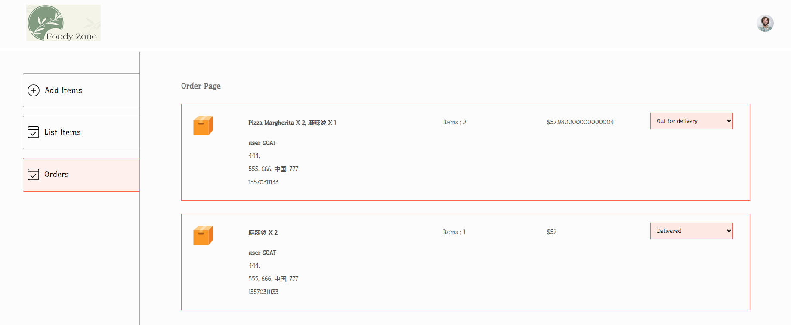
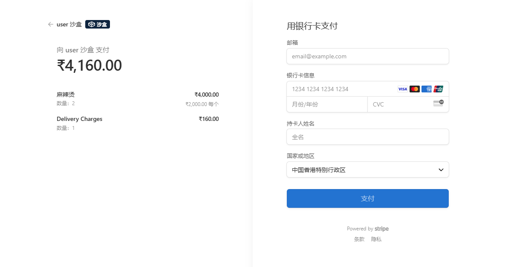

Blog Demo
https://via.placeholder.com/150 <!-- 如果有项目logo，替换这个占位符 -->

一个简洁的博客系统演示项目，使用现代Web技术栈构建。

功能特性
📝 文章发布与管理

🔍 内容分类与标签

💬 评论功能

👤 用户认证系统

🎨 响应式设计，适配各种设备

⚡ 高性能后端API

技术栈
前端
React.js

Redux

Material-UI

Axios

后端
Node.js

Express

MongoDB

Mongoose

快速开始
前提条件
Node.js (v14+)

MongoDB (v4+)

npm 或 yarn

安装步骤
克隆仓库：

bash
git clone https://github.com/udonkyatto/BlogDemo.git
cd BlogDemo
安装依赖：

bash
# 安装后端依赖
cd server
npm install

# 安装前端依赖
cd ../client
npm install
配置环境变量：
在server目录下创建.env文件：

text
MONGO_URI=你的MongoDB连接字符串
JWT_SECRET=你的JWT密钥
PORT=5000
启动开发服务器：

bash
# 启动后端
cd server
npm run dev

# 启动前端 (新终端窗口)
cd ../client
npm start
项目结构
text
BlogDemo/
├── client/                # 前端代码
│   ├── public/            # 静态资源
│   └── src/               # React源代码
├── server/                # 后端代码
│   ├── config/            # 配置文件
│   ├── controllers/       # 控制器
│   ├── models/            # 数据模型
│   ├── routes/            # 路由
│   └── server.js          # 主服务器文件
├── .gitignore
└── README.md
贡献指南
欢迎贡献！请遵循以下步骤：

Fork 本项目

创建你的分支 (git checkout -b feature/AmazingFeature)

提交你的修改 (git commit -m 'Add some AmazingFeature')

推送到分支 (git push origin feature/AmazingFeature)

提交 Pull Request

许可证
本项目采用 MIT 许可证 - 详情请见 LICENSE 文件。

联系方式
如有任何问题，请联系：

项目维护者: udonkyatto

邮箱: your-email@example.com

感谢您对本项目的关注！🚀

本回答由 AI 生成，内容仅供参考，请仔细甄别。
https://github.com/udonkyatto/EgOnlineStore为这个项目写一个优秀详细的README.md
给我
EgOnlineStore - 在线商城系统
https://via.placeholder.com/150x50?text=EgOnlineStore <!-- 替换为实际项目logo -->

一个基于现代Web技术栈构建的电子商务平台，提供完整的在线购物解决方案。

功能特性
🛒 完整的商品展示与购物流程

🔍 智能搜索与商品分类筛选

👤 用户认证与个人中心

🛍️ 购物车与订单管理系统

💳 多种支付方式集成

📊 后台管理仪表盘

📱 响应式设计，适配各种设备

技术栈
前端
React.js - 前端框架

Redux/Redux Toolkit - 状态管理

Ant Design - UI组件库

Axios - HTTP客户端

React Router - 路由管理

后端
Node.js - 运行时环境

Express - Web框架

MongoDB - 数据库

Mongoose - ODM

JWT - 认证机制

其他工具
Webpack - 模块打包

ESLint - 代码检查

Prettier - 代码格式化

快速开始
前提条件
Node.js (v16+)

MongoDB (v4.4+)

npm (v8+) 或 yarn (v1.22+)

安装步骤
克隆仓库：

bash
git clone https://github.com/udonkyatto/EgOnlineStore.git
cd EgOnlineStore
安装依赖：

bash
# 安装后端依赖
cd server
npm install

# 安装前端依赖
cd ../client
npm install
配置环境变量：
在server目录下创建.env文件：

text
MONGO_URI=mongodb://localhost:27017/egonlinestore
JWT_SECRET=your_jwt_secret_key
PORT=5000
启动开发服务器：

bash
# 启动后端 (在server目录)
npm run dev

# 启动前端 (在client目录)
npm start
项目结构
text
EgOnlineStore/
├── client/                  # 前端代码
│   ├── public/              # 静态资源
│   └── src/                 # React源代码
│       ├── assets/          # 静态资源
│       ├── components/      # 公共组件
│       ├── pages/           # 页面组件
│       ├── redux/           # Redux相关
│       ├── App.js           # 主应用组件
│       └── index.js         # 入口文件
├── server/                  # 后端代码
│   ├── config/              # 配置文件
│   ├── controllers/         # 控制器
│   ├── models/              # 数据模型
│   ├── routes/              # 路由
│   ├── middlewares/         # 中间件
│   └── server.js            # 主服务器文件
├── .gitignore
└── README.md
部署指南
生产环境部署
构建前端代码：

bash
cd client
npm run build
配置生产环境变量：

bash
NODE_ENV=production
MONGO_URI=your_production_mongo_uri
JWT_SECRET=your_production_jwt_secret
启动生产服务器：
bash
cd server
npm start

贡献指南
欢迎贡献！请遵循以下步骤：

Fork 本项目

创建你的分支 (git checkout -b feature/AmazingFeature)

提交你的修改 (git commit -m 'Add some AmazingFeature')

推送到分支 (git push origin feature/AmazingFeature)

提交 Pull Request

请确保你的代码通过ESLint检查并包含适当的测试。

许可证
本项目采用 MIT 许可证 - 详情请见 LICENSE 文件。

联系方式
如有任何问题，请联系：

项目维护者: udonkyatto
感谢您对EgOnlineStore项目的关注！🚀